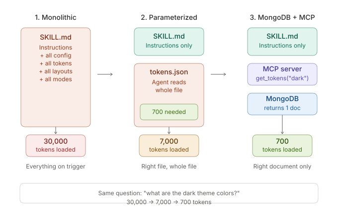
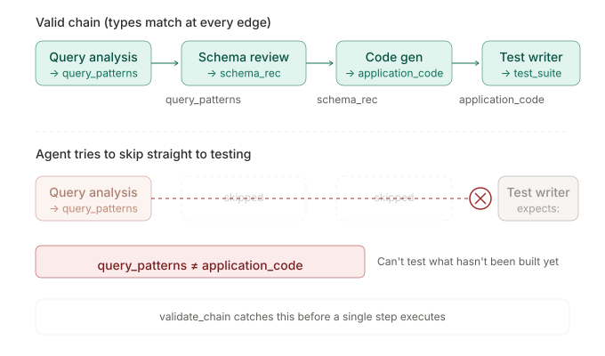

# Typed Skill Graphs for LLM Orchestration with MongoDB

A minimal template for building typed skill parameter retrieval and composition validation using MongoDB and `$graphLookup`.

**The pattern**: Store skill contracts (input types, output types, lifecycle states, dependencies) and parameterized configuration as MongoDB documents. Use `$graphLookup` to traverse dependency chains and validate composition before execution. Expose the graph through semantic MCP tools, not raw database access.



Read the companion blog post: *[Typed Skill Graphs for LLM Orchestration with MongoDB]*

## Quick start

Requires: **MongoDB 7.x+** running locally, **Python 3.10+**.

```bash
git clone https://github.com/meharsg96/skill-graph-mcp.git
cd skill-graph-mcp
git checkout v2                         # latest release

cp .env.example .env                    # MONGODB_URI defaults to mongodb://localhost:27017

# Set up an isolated env. Pick one:
python3 -m venv venv && source venv/bin/activate && pip install -r requirements.txt
# or, with uv:
# uv venv && uv pip install -r requirements.txt && source .venv/bin/activate

python scripts/seed.py                  # Seed skills, edges, parameters
python scripts/validate.py              # v1 plan-validation examples
python scripts/route.py ui_components   # v2: walk dependencies → ordered chain
python scripts/impact.py skill:schema-review   # v2: who breaks if this changes?
python server.py                        # Start the MCP server

# Or use mongosh
mongosh < scripts/queries.js
```

After running tools, summarise the captured `db.runs` log:

```bash
python scripts/analyze.py --all                 # blog 1 + blog 2 tables
python scripts/analyze.py --table blog2 \
       --session "$SESSION_ID"                  # one session at a time
python scripts/measure_baseline.py              # modeled file-read baseline,
                                                # compared against the analyze.py total
```

> **Heads up:** every `python …` command above must run inside the activated
> venv (or via `./venv/bin/python …` / `uv run python …`). A bare `python`
> without an activated env will hit `ModuleNotFoundError: No module named
> 'pymongo'`. `uv python scripts/…` is the wrong command — that subcommand
> manages Python installations; `uv run python scripts/…` is what executes
> a script.

## What's in the box

```
skill-graph-mcp/
├── server.py              # MCP server — 10 tools, instrumented
├── schema/
│   ├── skills.json        # 6 skills (5 active, 1 inactive) + 5 edges (ABI shape)
│   └── parameters.json    # tenant overrides (client-a, client-b)
├── scripts/
│   ├── seed.py            # Seeds skills + edges + parameters; preserves runs
│   ├── seed_tenants.py    # Idempotent re-seed of just the parameters collection
│   ├── validate.py        # Plan validation with $graphLookup
│   ├── route.py           # CLI wrapper for route_task
│   ├── impact.py          # CLI wrapper for impact_analysis
│   ├── analyze.py         # Renders the blog measurement tables from db.runs
│   ├── run_session.sh     # Tags SESSION_ID for everything that follows
│   └── queries.js         # mongosh examples
├── tests/                 # pytest — 39 tests across v1 + v2
├── docs/
│   ├── ARCHITECTURE.md    # load-bearing invariants
│   └── MIGRATION_v1_v2.md # what changed; why v1 callers need zero changes
└── README.md
```

## The key query

`$graphLookup` traverses the dependency chain, filtering by lifecycle during recursion:

```javascript
db.skills.aggregate([
  { $match: { _id: "skill:query-analysis" } },
  { $graphLookup: {
      from: "skills",
      startWith: "$_id",
      connectFromField: "_id",
      connectToField: "dependencies",
      as: "downstream",
      maxDepth: 10,
      depthField: "depth",
      restrictSearchWithMatch: { lifecycle: "active" }
  }}
])
```

Inactive skills never appear in results. Type mismatches are caught before execution.



## MCP server

`server.py` exposes ten tools backed by MongoDB. These are semantic graph operations, not raw database access:

```
# v1 — parameter retrieval, validation, traversal
get_skill_contract(skill_id)
get_tokens(skill_id, theme=, tenant=)             # tenant overrides design tokens
get_components(skill_id, category=, tenant=)       # tenant attaches component overrides
get_layouts(skill_id, breakpoint=, tenant=)
validate_chain(skill_ids)
traverse_dependencies(skill_id)

# v2 — contracts, routing, impact, tenants
route_task(target_output_type)                    # backward $graphLookup → ordered chain
search_skills(query, limit=)                      # Mongo text-index search (ranked relevance)
list_skills(lifecycle=, input_type=, output_type=)  # declarative enumeration (use this for "list everything")
get_skill_instructions(skill_id)                  # read the skill's markdown body
impact_analysis(skill_id)                         # direct + transitive consumers + incompatible edges
```

To connect to Claude Code:

```bash
claude mcp add skill-graph python server.py
```

## Instrumentation

Every tool call is logged to `db.runs` automatically — one document per call with
`tool`, `params`, `tokens_returned`, `duration_ms`, `session_id`, and `error`.

`SESSION_ID` is captured once at server startup. If unset, the server falls back
to `session:auto-<pid>-<epoch>` so calls within one server process still group.
Standalone runs:

```bash
export SESSION_ID="session:$(date +%s)"
python server.py
```

When the server is launched by an MCP host (e.g. `claude mcp add`), MCP's stdio
transport does **not** forward parent env vars by default — you must list them
explicitly in the host's MCP server config (`env: { "SESSION_ID": "..." }`).
Without that, the auto fallback gives you per-process grouping for free.

For ad-hoc end-to-end runs from a shell, `scripts/mcp_host.py` is a thin client
that explicitly forwards `MONGODB_URI` and `SESSION_ID` through the stdio
transport, so `SESSION_ID=foo scripts/run_session.sh python scripts/mcp_host.py
route_task ui_components` produces a log entry tagged `session:foo`.

The `runs` collection is created lazily and **never dropped on re-seed**, so
historical sessions accumulate. Documents expire after 90 days via a TTL index.

## Series

| Tag | Blog | Adds |
|-----|------|------|
| [`v1`](https://github.com/meharsg96/skill-graph-mcp/tree/v1) | Your Agent Reads Around Your Skill Files | typed skill graph, 6 tools |
| [`v2`](https://github.com/meharsg96/skill-graph-mcp/tree/v2) | Agent Skills Need Contracts, Not Just Descriptions | ABI shape, routing, impact analysis, tenant params, **LeafyGreen UI** as a real-world design-system skill, **React test chain**, **`skill:harness` self-documenting meta-skill**, **`preferences` collection** for per-deployment usage policies |
| `v3` *(planned)* | TBD | artifact validation + repair |

**v2.3.0 adds two things, both informed by R3:**
- **`skill:harness`** — the system documents itself using its own pattern. Ask `get_skill_instructions(skill:harness)` for SESSION_ID conventions, TTL behavior, analyze.py recipes, archival, and pitfalls. The architecture eats its own dog food.
- **Richer `get_skill_instructions`** — now returns markdown body + `line_count` + `accessibility_rules` + related skills (deps + direct consumers) + `source: "graph"` provenance. Strictly more useful than `Read`, so the agent has a real reason to prefer the graph path.

To add your own parameterized skill to the graph (the question every reader
asks after the series), see [docs/ADDING_A_SKILL.md](docs/ADDING_A_SKILL.md) —
a six-stage pipeline with LeafyGreen as the worked example.

`v2.1.0` adds [`skill:leafygreen-ui`](skills/leafygreen/SKILL.md) — MongoDB's
own design system as a parameterized skill graph node, with the full
[LeafyGreen UI](https://github.com/mongodb/leafygreen-ui) tokens and
component spec served through `get_tokens(theme=)` and
`get_components(category=)` exactly the way the architecture intends.
Adding it pushed the graph-path-vs-file-read efficiency ratio from 4.22×
to **16.36×** — the demo-system bloat that the graph path sidesteps grows
faster than the per-call cost of querying it.

To upgrade in place: `git fetch --tags && git checkout v2`. v1 callers need
zero changes — see [docs/MIGRATION_v1_v2.md](docs/MIGRATION_v1_v2.md).

## License

MIT
